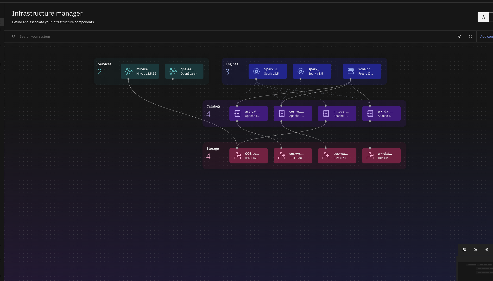
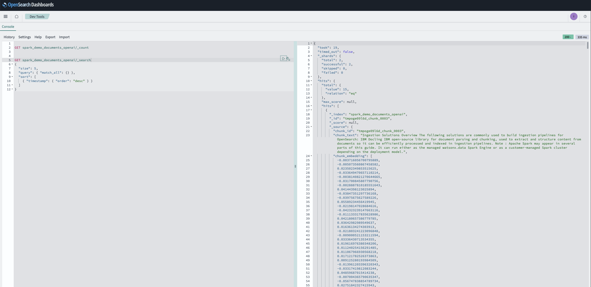
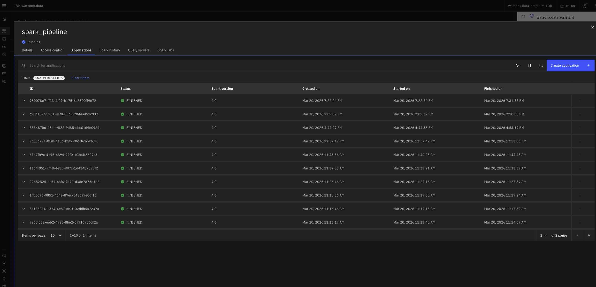

# PDF to OpenSearch Pipeline (Docling + Spark)

This project turns PDF files into searchable knowledge in OpenSearch.

In plain language:
- You put PDFs in object storage.
- Spark processes many PDFs at once.
- Docling reads each PDF and understands structure (sections, tables, text flow).
- The pipeline creates smaller text chunks, adds metadata/entities, and generates embeddings.
- Everything is indexed into OpenSearch for search and retrieval.

---

## Why we chose this approach

### 1) Why watsonx.data Spark Engine

We expect document volume to grow.  
A single-machine parser is not enough for large-scale ingestion.

Spark gives us:
- parallel processing (faster with many files),
- retry behavior for failed tasks,
- a repeatable job-based process for production runs.

### 2) Why Docling

Docling is better than simple text extraction for real documents:
- understands layout and reading order,
- handles sections/tables/mixed content,
- supports OCR scenarios for scanned files,
- keeps a structured internal representation.

This improves chunk quality, which improves search quality.

### 3) Why custom ingestion logic

Real production use needs custom controls:
- metadata fields,
- entity extraction behavior,
- embedding provider choices,
- OpenSearch mapping and validation checks.

For broader ingestion strategy context, see:
- [`OpenSearch Ingestion Guidance.pdf`](OpenSearch%20Ingestion%20Guidance.pdf)

---

## Flow diagram content  
 

---

## How parsing and enrichment works

1. Spark reads PDFs using `binaryFile`.
2. Each executor writes binary content to temp local PDF files.
3. Docling parses each PDF into structured document elements (models load once per executor, not once per PDF).
4. Chunking logic creates manageable search chunks.
5. Entity extraction adds labels to chunks.
6. Embeddings are generated per chunk (provider-configurable).
7. Each executor partition bulk-indexes its own chunks directly into OpenSearch in parallel — chunks never travel back to the driver.

---

## Scalability design

These decisions allow the pipeline to handle large PDF volumes without driver OOM or serial bottlenecks:

| What | How |
|---|---|
| Docling model load | Singleton per executor — loads once, reused for all PDFs on that worker |
| OpenSearch writes | `foreachPartition` — each executor writes its own chunks in parallel |
| Chunk memory | Never collected to driver — memory stays flat as PDF count grows |
| OCR | Off by default (`docling.do_ocr: false`) — enable only for scanned PDFs |
| Executors | Default 4 (`spark.executor.instances`) — increase for larger batches |

---

## Entity extraction note

- Entity extraction is currently regex-based baseline.
- Production alternatives: spaCy, GLiNER, transformer NER, or LLM schema extraction.

---

## What Happens When `main.py` Runs (High-Level Order)

This is the runtime order so new users can understand which code is used where.

1. **Start Spark session** (`src/main.py`)
   - Creates the Spark app context.
   - Parses input args (`--config`).

2. **Load and validate config** (`src/utils.py`)
   - Reads YAML config (local or S3 path).
   - Validates required sections/fields.

3. **Bootstrap dependencies if needed** (`src/bootstrap.py`)
   - Installs required Python packages on driver/executors when runtime is missing libs.
   - Re-checks imports before real processing.

4. **Read PDFs from object storage** (`src/main.py`)
   - Spark reads PDFs using `binaryFile` (`path` + binary `content`).

5. **Process each PDF on executors** (`src/main.py` + `src/pdf_processor.py`)
   - UDF sends each PDF item to `process_pdf_batch`.
   - `PDFProcessor` and `WatsonxEmbeddings` are singletons per executor process — Docling models load once, not once per PDF.
   - `PDFProcessor.parse_pdf()` uses Docling to parse structure.
   - `PDFProcessor.chunk_document()` creates semantic chunks.
   - `PDFProcessor.extract_entities()` adds entity labels.

6. **Generate embeddings for each chunk** (`src/embeddings.py`)
   - Uses configured provider:
     - OpenAI (`embeddings.provider=openai`) or
     - watsonx (`embeddings.provider=watsonx`)
   - Adds `chunk_embedding` to each chunk.

7. **Index into OpenSearch in parallel** (`src/main.py` + `src/opensearch_indexer.py`)
   - Index is created once on the driver before partitions start (avoids creation race).
   - Each executor partition normalises its own chunks and bulk-indexes directly into OpenSearch via `foreachPartition`.
   - Chunks never collect to the driver — memory use stays flat regardless of PDF volume.

9. **Write run outcome logs** (`src/main.py`)
   - Writes success/failure summary to S3 logs path.
   - Stops Spark session cleanly.

---

## Active files (current)

- `src/main.py` - pipeline orchestration
- `src/pdf_processor.py` - Docling parsing/chunking/entities
- `src/embeddings.py` - embeddings provider switch
- `src/opensearch_indexer.py` - OpenSearch indexing
- `src/bootstrap.py` - dependency bootstrap helper
- `scripts/submit_payload.sh` - Spark submit helper
- `scripts/payload_main_bootstrap.json` - active Spark payload
- `config/pipeline_config_saas.yaml` - runtime config

---

## Critical config rule

`opensearch.embedding_dimension` must match the embedding model output.

Example:
- OpenAI `text-embedding-3-small` -> `1536`

If this is wrong, indexing may fail even when Spark job appears successful.

---

## Using watsonx.ai embeddings  

When `embeddings.provider` is set to `watsonx`, the pipeline calls watsonx.ai embedding APIs for each chunk and stores those vectors in OpenSearch.

Required `watsonx_ai` fields in `config/pipeline_config_saas.yaml`:
- `watsonx_ai.api_key` (IBM Cloud IAM API key)
- `watsonx_ai.endpoint` (regional watsonx.ai URL)
- `watsonx_ai.project_id` (watsonx project GUID)
- `watsonx_ai.embedding_model` (embedding model available in that project/region)

Step-by-step:
1. Create an IBM Cloud API key:
   - Open IBM Cloud console.
   - Go to **Manage -> Access (IAM) -> API keys**.
   - Create a new key and copy it immediately.
2. Create or open a watsonx project:
   - Open watsonx.ai.
   - Create a project (or open existing).
   - Ensure the project is associated with a Watson Machine Learning service instance in the same region.
3. Get your `project_id`:
   - In the watsonx project, open project settings/details.
   - Copy the project GUID and set it as `watsonx_ai.project_id`.
4. Choose matching regional endpoint:
   - Use endpoint for the same region as the project (for example `https://us-south.ml.cloud.ibm.com`).
   - Set it as `watsonx_ai.endpoint`.
5. Configure model + vector dimension:
   - Set `watsonx_ai.embedding_model` to a model available in your project region.
   - Set `opensearch.embedding_dimension` to match the model output dimension exactly.
6. Run a small validation before full Spark runs:
   - Start with a tiny PDF sample and low executor count.
   - Confirm logs show embeddings generated and documents indexed.

Common failure reasons:
- Endpoint region and project region do not match.
- Model is not available in your project/region.
- Missing project-service association (project not properly connected to WML).
- Embedding dimension in OpenSearch mapping does not match model output.

---

## Run from scratch

Follow:
- [`SETUP_GUIDE.md`](SETUP_GUIDE.md)

It includes full steps for:
- environment setup,
- watsonx.data Spark access,
- upload + submit flow,
- validation + troubleshooting.

