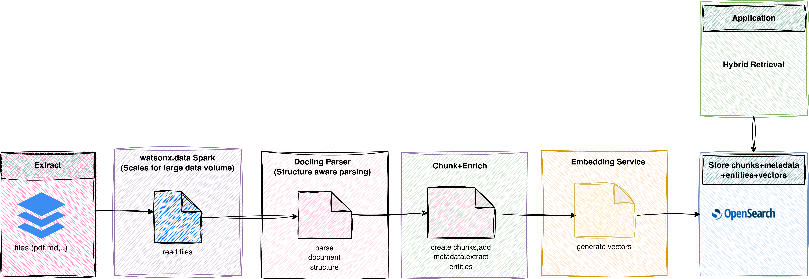

# PDF to OpenSearch Pipeline (Docling + Spark)

This project turns PDF files into searchable knowledge in OpenSearch.

In plain language:
- You put PDFs in object storage.
- Spark processes many PDFs at once.
- Docling reads each PDF and understands structure (sections, tables, text flow).
- The pipeline creates smaller text chunks, adds metadata/entities, and generates embeddings.
- Everything is indexed into OpenSearch for search and retrieval.

---

## Why we chose this approach

### 1) Why watsonx.data Spark Engine

We expect document volume to grow.  
A single-machine parser is not enough for large-scale ingestion.

Spark gives us:
- parallel processing (faster with many files),
- retry behavior for failed tasks,
- a repeatable job-based process for production runs.

### 2) Why Docling

Docling is better than simple text extraction for real documents:
- understands layout and reading order,
- handles sections/tables/mixed content,
- supports OCR scenarios for scanned files,
- keeps a structured internal representation.

This improves chunk quality, which improves search quality.

### 3) Why custom ingestion logic

Real production use needs custom controls:
- metadata fields,
- entity extraction behavior,
- embedding provider choices,
- OpenSearch mapping and validation checks.

For broader ingestion strategy context, see:
- [`OpenSearch Ingestion Guidance.pdf`](OpenSearch%20Ingestion%20Guidance.pdf)

---

## Flow diagram content  
 

---

## How parsing and enrichment works

1. Spark reads PDFs using `binaryFile`.
2. Each executor writes binary content to temp local PDF files.
3. Docling parses each PDF into structured document elements.
4. Chunking logic creates manageable search chunks.
5. Entity extraction adds labels to chunks.
6. Embeddings are generated (provider-configurable).
7. Normalized chunk documents are bulk-indexed in OpenSearch.

---

## What Happens When `main.py` Runs (High-Level Order)

This is the runtime order so new users can understand which code is used where.

1. **Start Spark session** (`src/main.py`)
   - Creates the Spark app context.
   - Parses input args (`--config`).

2. **Load and validate config** (`src/utils.py`)
   - Reads YAML config (local or S3 path).
   - Validates required sections/fields.

3. **Bootstrap dependencies if needed** (`src/bootstrap.py`)
   - Installs required Python packages on driver/executors when runtime is missing libs.
   - Re-checks imports before real processing.

4. **Read PDFs from object storage** (`src/main.py`)
   - Spark reads PDFs using `binaryFile` (`path` + binary `content`).

5. **Process each PDF on executors** (`src/main.py` + `src/pdf_processor.py`)
   - UDF sends each PDF item to `process_pdf_batch`.
   - `PDFProcessor.parse_pdf()` uses Docling to parse structure.
   - `PDFProcessor.chunk_document()` creates semantic chunks.
   - `PDFProcessor.extract_entities()` adds entity labels.

6. **Generate embeddings for each chunk** (`src/embeddings.py`)
   - Uses configured provider:
     - OpenAI (`embeddings.provider=openai`) or
     - watsonx (`embeddings.provider=watsonx`)
   - Adds `chunk_embedding` to each chunk.

7. **Normalize chunk docs for indexing** (`src/main.py`)
   - Flattens row shape (`chunk` object).
   - Ensures required fields exist (`chunk_id`, `chunk_text`, metadata).

8. **Index into OpenSearch** (`src/opensearch_indexer.py`)
   - Creates index if missing (`create_index_if_not_exists`).
   - Bulk indexes chunk documents (`bulk_index`).

9. **Write run outcome logs** (`src/main.py`)
   - Writes success/failure summary to S3 logs path.
   - Stops Spark session cleanly.

---

## Active files (current)

- `src/main.py` - pipeline orchestration
- `src/pdf_processor.py` - Docling parsing/chunking/entities
- `src/embeddings.py` - embeddings provider switch
- `src/opensearch_indexer.py` - OpenSearch indexing
- `src/bootstrap.py` - dependency bootstrap helper
- `scripts/submit_payload.sh` - Spark submit helper
- `scripts/payload_main_bootstrap.json` - active Spark payload
- `config/pipeline_config_saas.yaml` - runtime config

---

## Critical config rule

`opensearch.embedding_dimension` must match the embedding model output.

Example:
- OpenAI `text-embedding-3-small` -> `1536`

If this is wrong, indexing may fail even when Spark job appears successful.

---

## Run from scratch

Follow:
- [`SETUP_GUIDE.md`](SETUP_GUIDE.md)

It includes full steps for:
- environment setup,
- watsonx.data Spark access,
- upload + submit flow,
- validation + troubleshooting.

